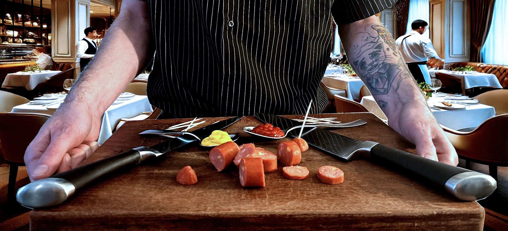
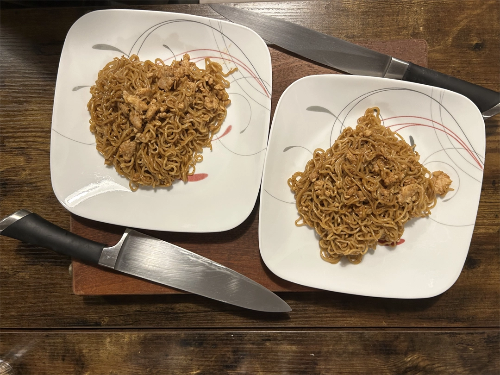
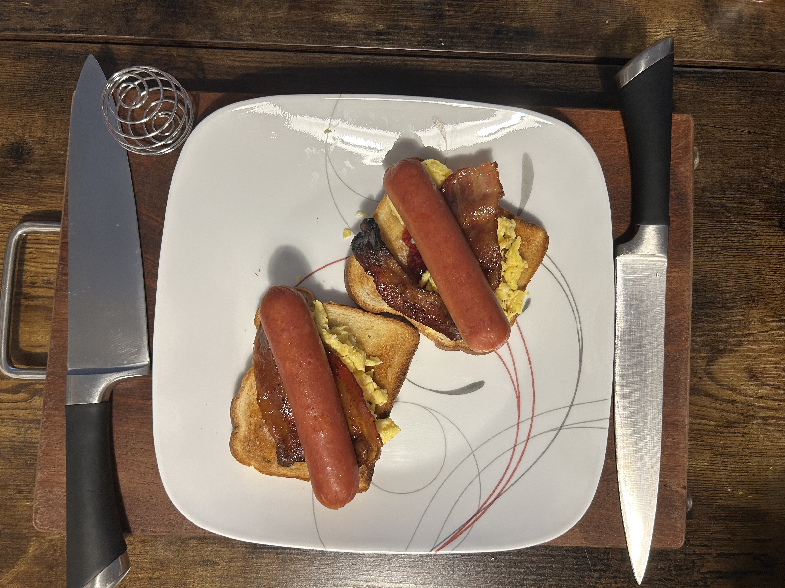

# Simple Cooking with Chef Tristian

> **A satirical spoof of recipe websites that mocks the endless ads, filler content, and life stories that plague online cooking sites. I just want the recipe.**

## Screenshots

### Homepage

*Chef Tristian's welcoming hero section with professional presentation*

### Recipe Showcase

*Interactive recipe carousel featuring signature dishes*

### Responsive Design

*Fully responsive design that works on all devices*

## About the Developer

**Tristian** is a Software Engineer transitioning from a background in the food industry. In home life he likes to cook, and when he looks up something new to cook every site is the same. He got tired of scrolling through endless ads and life stories just to find a simple recipe. With a background in web development and a need to cook, this project was more just a frustration of how bad all those recipe sites were. It was also my first introduction to BootStrap. The whole focus of the project was to use minimal CSS and use BootStrap for styling.

**Connect with me:**
- [LinkedIn](https://www.linkedin.com/in/tristiandavis/) - Professional network
- [Email](mailto:tristiangdavis@gmail.com) - Get in touch directly

## Project Overview

**Simple Cooking with Chef Tristian** is a **satirical site** that I worked on while learning new web development tools.

### What Makes This Project Special

- **It is just Satirical**: Every ad, every "pro tip," every unnecessary story is a deliberate parody
- **Real Recipes, Real Photos**: Despite the joke, every recipe has been personally tested and photographed
- **Responsive Design**: Works on desktop, tablet, and mobile devices
- **Bootstrap-First Approach**: Minimal custom CSS, maximum Bootstrap utilization
- **Comedic Timing**: Perfectly placed ads and filler content that feel like the other recipe sites

## Technical Implementation

### Built With
- **HTML5**: Semantic markup for accessibility and SEO
- **Bootstrap 5.3.0**: Responsive grid system and components
- **CSS3**: Custom styling and animations
- **JavaScript**: Interactive carousels and modals
- **Responsive Images**: Optimized for all screen sizes

### Key Features Implemented
 **Responsive Navigation**: Hamburger menu for mobile devices  
 **Hero Sections**: Engaging visual introductions on both pages  
 **Interactive Carousels**: Single and multiple item carousels  
 **Dropdown Menus**: Quick navigation to favorite recipes  
 **Card-Based Layout**: Clean recipe presentation  
 **Modal Systems**: Subscribe forms and side panels  
 **Professional Typography**: Custom Google Fonts integration  
 **Border Styling**: Consistent visual hierarchy  
 **Satirical Ads**: Hilarious mock advertisements throughout  
 **Filler Content**: Deliberately over the top recipe descriptions  

## Development Story

### The Inspiration
This project began with a simple frustration. Every time I searched for a recipe online, I'd find myself scrolling through pages of ads, life stories, and unnecessary content before reaching the actual recipe. As someone who likes to cook and code, I saw an opportunity to create something that would hopefully make people laugh while demonstrating my technical skills.

### From Frustration to Comedy
The development process started with the idea of creating an over the top, ad filled recipe website possible. We had to use Bootstrap 5 for this project. I wanted to do more, but I was limited to the requirements. So instead I just filled it with content.

### The Culinary Challenge
Each recipe featured on the site was personally cooked, photographed, and documented. This wasn't just a web development project. It required planning, execution, and documentation of real cooking processes, all while maintaining the comedic tone. And at the same time meals that I would actually eat.

## Future Enhancements

### Planned Features
- **More Satirical Ads**: Additional mock advertisements and popups
- **Ad Blocker Detection**: Fake warnings about ad blockers
- **Cookie Consent**: Ridiculous cookie consent popups
- **Newsletter Signup**: Multiple aggressive subscription prompts

### Technical Improvements
- **Performance Optimization**: Intentionally slow loading for authenticity
- **SEO Enhancement**: Meta tags filled with unnecessary keywords
- **Accessibility**: ARIA labels that are deliberately unhelpful

## Challenges Overcome

### 1. Satirical Balance
**Challenge**: Creating content that's funny without being mean-spirited  
**Solution**: Focused on parodying the format and style rather than specific websites or creators. I included myself as a joke.

### 2. Technical Excellence vs. Comedic Intent
**Challenge**: Making a technically sound website that looks intentionally cluttered  
**Solution**: Used Bootstrap's professional components but filled them with satirical content.

### 3. Content Creation
**Challenge**: Writing recipe descriptions that are both funny and informative  
**Solution**: Created a mix of genuine cooking advice and over the top culinary sounding language.

### 4. User Experience
**Challenge**: Making a parody site that's still functional and enjoyable  
**Solution**: Ensured the core functionality works perfectly while adding comedic elements.

## Getting Started
---

**Built with love, cooking, and a healthy dose of satire by Chef Tristian**
### Instructions
- No build process required - pure HTML/CSS/JS
- just visit https://tebariousbag.github.io/atlas-bootstrap/

---

## **Disclaimer**
This project is a **satirical parody** created for entertainment purposes. It is not intended to mock any specific website or creator, but rather to comment on the general state of online recipe content. All recipes featured are genuine and have been personally tested by Chef Tristian.
